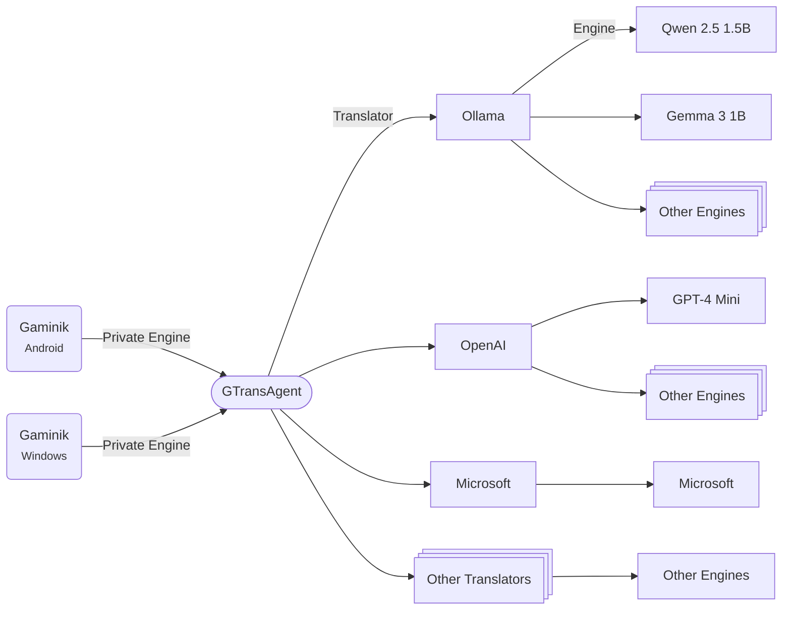

English | [简体中文](./README_CN.md)

# GTransAgent

A proxy translation tool designed to work with the `private translation engine` feature of [Gaminik](https://www.gaminik.cn/):
- Developed with `Kotlin`, supports multi-OS operation.
- Supports invoking privately deployed LLMs like `Qwen-Turbo`, `Gemma 3` (via `Ollama`).
- Supports all mainstream translation engines (requires self-applied `apiKey`).
- Experimental free access to `Google`, `Microsoft`, `Yandex`, `Tencent` translation engines.
- Customizable prompts when using LLMs for translation.

## Overview
Relationship between `GTransAgent`, `Gaminik`, `Translator`, and `Translation Engine`:



**💡Note:** A translator may contain one or multiple engines. e.g., `OpenAI` translator can configure engines like `GPT-4 Mini`, `GPT-4.1 Nano`, while `Google` translator only contains `Google` engine.

Configure enabled **translators** before starting `GTransAgent`.

## Supported OS
- [x] Windows (x64)
- [x] Mac OS (Intel and Arm)
- [x] Linux / [FreeBSD]

## Supported Translators

| Translator | Engines | API Key Required | Notes |
|---|---|---|---|
| [Ollama](./docs/translators/Ollama.md) |Gemma, Qwen...| × |Requires local LLM deployment via [Ollama](https://ollama.org.cn/)|
| [DeepLX](./docs/translators/DeepLX.md) |DeepL| × |Requires [DeepLX](https://deeplx.owo.network/)|
| [Google](./docs/translators/Google.md) |Google| ✓ ||
| [DeepL](./docs/translators/DeepL.md) |DeepL| ✓ ||
| [Microsoft](./docs/translators/Microsoft.md) |Microsoft| ✓ ||
| [Yandex](./docs/translators/Yandex.md) |Yandex| ✓ ||
| [Youdao](./docs/translators/Youdao.md) |Youdao| ✓ ||
| [Volcengine](./docs/translators/Volcengine.md) |Volcengine| ✓ ||
| [Niutrans](./docs/translators/Niutrans.md) |Niutrans| ✓ ||
| [Baidu](./docs/translators/Baidu.md) |Baidu| ✓ ||
| [OpenAI](./docs/translators/OpenAI.md) |Gpt 4 mini, Gpt 4.1 nano ...| ✓ |Supports multiple models|
| [Gemini](./docs/translators/Gemini.md) |Gemini 2.0 Flash, Gemini 2.5 Pro ...| ✓ |Supports multiple models|
| [Anthropic](./docs/translators/Anthropic.md) |Claude 3 Haiku...| ✓ |Supports multiple models|
| [Mistral](./docs/translators/Mistral.md) |Mistral Small, Ministral 8B ...| ✓ |Supports multiple models|
| [AliyunBailian](./docs/translators/AliyunBailian.md) |Qwen-Plus, Qwen-Turbo ...| ✓ |Supports multiple models|
| [BigModel](./docs/translators/BigModel.md) |GLM-4-Plus, GLM-4-Flash ...| ✓ |Supports multiple models|
| [DeepSeek](./docs/translators/DeepSeek.md) |DeepSeek V3| ✓ |Supports multiple models|
| [VolcengineArk](./docs/translators/VolcengineArk.md) |Doubao-1.5-pro, DeepSeek V3 ...| ✓ |Supports multiple models|
| [GoogleExperimental](./docs/translators/GoogleExperimental.md) |Google| × |△|
| [MicrosoftExperimental](./docs/translators/MicrosoftExperimental.md) |Microsoft| × |△|
| [TencentExperimental](./docs/translators/TencentExperimental.md) |Tencent| × |△|
| [YandexExperimental](./docs/translators/YandexExperimental.md) |Yandex| × |△|

💡Click translator name for configuration details. △ indicates experimental stability

## Usage

### [**👍Recommended**] Using the version **with JRE**
Find the latest `GTransAgent-bin-{version}-{win/mac/linux}-{x86-64/aarch64}.zip` on the `Release` page. This version includes JRE and can run without local Java installation.

#### 1. Download
Download the `zip` file and copy it to your target directory (avoid non-[ASCII](https://www.w3schools.com/charsets/ref_html_ascii.asp) paths).

#### 2. Extract
- **Windows**  
  Right-click the `zip` file and select "Extract All..."

- **Mac & Linux**  
  Open Terminal ([How to open or quit Terminal on Mac](https://support.apple.com/guide/terminal/apd5265185d-f365-44cb-8b09-71a064a42125/mac), [Opening a terminal on Ubuntu](https://ubuntu.com/tutorials/command-line-for-beginners#3-opening-a-terminal)), then run:  
    ```shell
    cd {directory-containing-zip-file, e.g., /home/ecs-user/}
    unzip GTransAgent-bin-{xxx}.zip
    ```

#### 3. Configuration
Refer to [Configuration](#config)

#### 4. Launch
- **Windows**  
  Navigate to the extracted directory and double-click `GTransAgent.exe`.

- **Linux**  
  In Terminal, run:  
    ```shell
    cd GTransAgent
    ./bin/GTransAgent
    ```

- **Mac**  
  In Terminal, run:  
    ```shell
    cd GTransAgent
    ./GTransAgent.app/Contents/MacOS/GTransAgent
    ```

---

### Using the version **without JRE**
Find the latest `GTransAgent-bin-{version}-jar.zip` on the `Release` page. This version requires [Java 8](https://www.java.com/en/download/) or higher installed locally. **It offers broader compatibility** and can run on **all platforms supported by Java**.  

#### 1. Download
Download the `zip` file and copy it to your target directory (avoid non-[ASCII](https://www.w3schools.com/charsets/ref_html_ascii.asp) paths).

#### 2. Extract
Same as the version with JRE.

#### 3. Configuration
Refer to [Configuration](#config)

#### 4. Launch
- **Windows**  
  Navigate to the extracted directory, right-click in an empty area, select "Open in Terminal", then run:  
    ```shell
    .\run.bat
    ```

- **Mac & Linux**  
  In Terminal, run:  
    ```shell
    cd GTransAgent
    ./run.sh
    ```

---

### Successful Launch
After launching, the following information will be displayed, indicating a successful launch:
```shell
Found config file in path: C:\Users\xxx\Downloads\GTransAgent, all lookup paths: [C:\Users\xxx\Downloads\GTransAgent, C:\Users\xxx\Downloads]
GTransAgent Version: v1.0, BuildNumber: 10
The Ollama Translator has been initialized. Engines: [Gemma 3 1B, Gemma 3 4B QAT, Qwen 2.5 1.5B]
The GoogleExperimental Translator has been initialized. Engines: [GoogleExperimental]
The MicrosoftExperimental Translator has been initialized. Engines: [MicrosoftExperimental]
The TencentExperimental Translator has been initialized. Engines: [TencentExperimental]
The YandexExperimental Translator has been initialized. Engines: [YandexExperimental]
GTransAgent is listening on port 6028. The service can be accessed at http://localhost:6028, with the security key located in the file at C:\Users\xxx\Downloads\GTransAgent\.skey
```


### Configuration <a id="config"></a>

1. Edit `config.yaml` in root directory. Add enabled translators under `enablesTranslators`, [YAML Syntax](https://docs.ansible.com/ansible/latest/reference_appendices/YAMLSyntax.html):

    ```yaml
    port: 6028 # Server port
    enablesTranslators:
    - Ollama
    - Google
    - Microsoft
    ```

    > **Note:** Default port is `6028`. Modify as needed.

2. Configure translator files in `translator` directory. e.g., edit `Google.yaml`:

    ```yaml
    url: https://translation.googleapis.com/language/translate/v2
    apiKey: YOUR_GOOGLE_CLOUD_KEY
    ```

    > **Note:** Configuration formats vary per translator.

3. If `Gaminik` runs on another device, configure firewall to allow TCP access on specified port. [Firewall Guide](https://www.wikihow.com/Open-Ports)

### Connecting from Gaminik
#### Access URL
- Local device: `http://localhost:6028`
- LAN: `http://{LAN_IP}:6028`, for example: `http://192.168.1.123:6028`.
- WAN: `http://{PUBLIC_IP}:6028` (requires public IP) [What is Public IP Address?](https://www.geeksforgeeks.org/what-is-public-ip-address/)

#### Security Key

After the first launch of `GTransAgent`, a random key will be generated and saved to the `.skey` file in the root directory. Open the `.skey` file and copy the 16-character-long string from it.

## Advanced

### Logs
Logs stored in `log/` directory: `log.log` (all), `error.log` (errors).

### Modify Key
Change key: Edit `.skey` (16-character string)

## Build from Source

### Dependencies
- JDK 17
- Gradle
- Kotlin

### Build Instructions

- Compile and package the JAR

    ```shell
    chmod +x ./gradlew
    ./gradlew clean -x test packageJarZipArchive
    ```

- Compile and package with jpackage

    ```shell
    chmod +x ./gradlew
    ./gradlew clean -x test packageJpackageZipArchive
    ```

- The successfully built `zip` files are saved under the `releases` directory

## Contributing
See [CONTRIBUTING.md](./CONTRIBUTING.md) for code submission guidelines.

## License

`GTransAgent` is released under the [GPL-3.0 license](./LICENSE).

## FAQ

- After launching, if you see the error **"Failed to bind to address 0.0.0.0/0.0.0.0:6028"**:  
    This may occur if: 
    1. Multiple instances of `GTransAgent` are running simultaneously. Close all `GTransAgent` processes and restart.
    2. **Port 6028** is occupied by another application. Try switching to a different port.

- **`Gaminik` fails to connect to `GTransAgent`**

    Check that the access URL format, IP address, and port are correct. If they’re on different devices, verify that the firewall rules allow the connection. If they’re not on the same LAN, also ensure that the machine running `GTransAgent` is reachable via its public IP.

- **`Gaminik` connects to `GTransAgent` but translation fails**

    Check the runtime logs of `GTransAgent` and verify the configuration of the relevant translators based on the error messages in the logs. For example, ensure the `apiKey` is correct and the configured `url` is accessible.

- **Which translators may not be available in mainland China**

    Translators such as `Google`, `Gemini`, `Anthropic`, `OpenAI`, `Mistral`, and `GoogleExperimental` cannot be accessed directly from within mainland China.