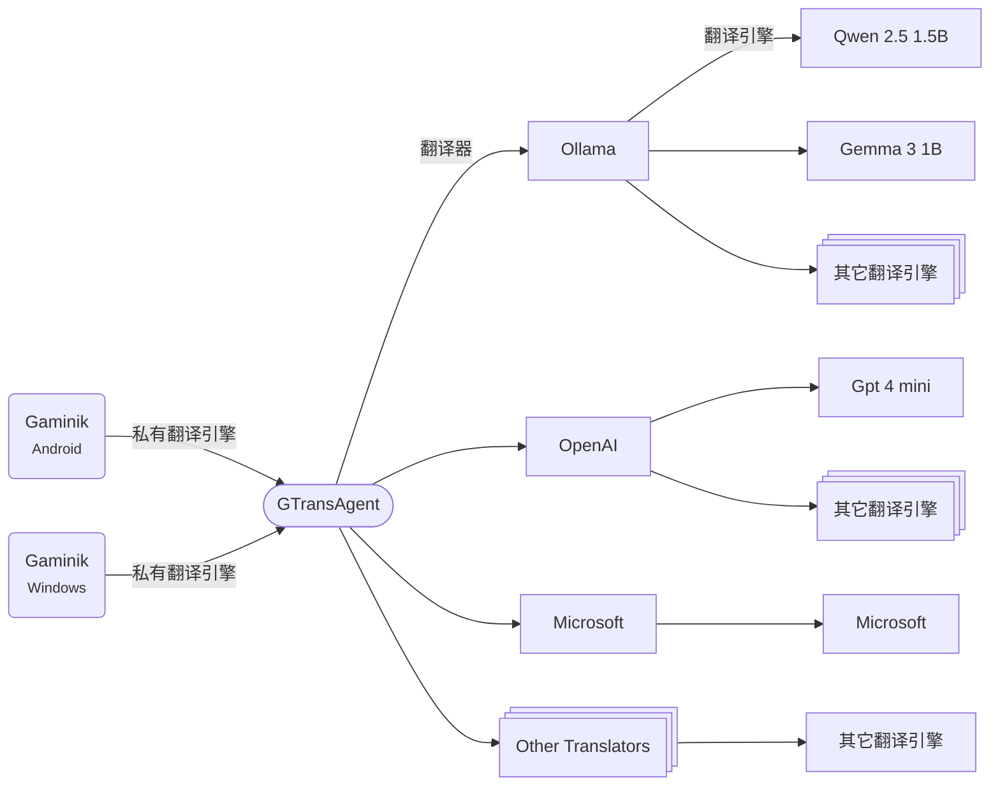

[English](./README.md) | 简体中文

# GTransAgent

与 [Gaminik](https://www.gaminik.cn/) `私有翻译引擎` 特性配合使用的代理翻译软件:
- 基于 `Kolin` 开发, 支持多操作系统运行.
- 支持调用私有化部署的大语言模型, 如: `通义千问-Turbo`, `Gemma 3` 等 (通过调用 `Ollama`).
- 支持调用所有主流翻译引擎 (需要自行申请并配置 `apiKey`).
- 支持免费调用 `Google`, `Microsoft`, `Yandex`, `Tencent` 等翻译引擎 (`实验性`).
- 使用大语言模型进行翻译时可以自定义提示词.


<!-- @import "[TOC]" {cmd="toc" depthFrom=2 depthTo=3 orderedList=false} -->

**目录**
<!-- code_chunk_output -->

- [介绍](#介绍)
- [支持操作系统](#支持操作系统)
- [支持的翻译器](#支持的翻译器)
- [`GTransAgent` 用法](#gtransagent-用法)
  - [使用带 `JRE` 版本](#使用带-jre-版本)
  - [使用不带 `JRE` 版本](#使用不带-jre-版本)
  - [启动成功界面](#启动成功界面)
  - [配置方式 ](#配置方式-a-idconfiga)
  - [`Gaminik` 连接方式](#gaminik-连接方式)
- [高级设置](#高级设置)
  - [日志查看](#日志查看)
  - [修改密钥](#修改密钥)
- [手动编译](#手动编译)
  - [依赖项](#依赖项)
  - [编译方式](#编译方式)
- [贡献说明](#贡献说明)
- [许可协议](#许可协议)
- [常见问题](#常见问题)

<!-- /code_chunk_output -->


## 介绍
`GTransAgent` 与 `Gaminik`, `翻译器`, `翻译引擎` 的关系如下图所示:



**💡Note:** 一个翻译器可能会包含一个或者多个翻译引擎. 例如, `OpenAI` 翻译器可以配置为包含 `Gpt 4 mini`, `Gpt 4.1 nano` 等翻译引擎. 而 `Google` 翻译器则只包含 `Google` 翻译引擎.

在启动 `GTransAgent` 之前, 需要先配置要 **启用** 的 `翻译器`.


## 支持操作系统
- [x] Windows (x64)
- [x] Mac OS (Intel and Arm)
- [x] Linux / [FreeBSD]


## 支持的翻译器

| 翻译器  | 翻译引擎  | 需要 API Key ? | 备注  |
|---|---|---|---|
| [Ollama](./docs/translators/Ollama.md) |Gemma, Qwen ...| x  |需要先私有化部署大语言模型, [Ollama 介绍](https://ollama.org.cn/)|
| [DeepLX](./docs/translators/DeepLX.md)  |DeepL| x  |需要自行下载并运行 [DeepLX](https://deeplx.owo.network/)|
| [Google](./docs/translators/Google.md)  |Google| ✓  ||
| [DeepL](./docs/translators/DeepL.md)  |DeepL| ✓  ||
| [Microsoft](./docs/translators/Microsoft.md)  |Microsoft| ✓  ||
| [Yandex](./docs/translators/Yandex.md)  |Yandex| ✓  ||
| [Youdao](./docs/translators/Youdao.md)  (有道翻译) |Youdao| ✓  ||
| [Volcengine](./docs/translators/Volcengine.md)  (火山翻译) |Volcengine| ✓  ||
| [Niutrans](./docs/translators/Niutrans.md)  (小牛翻译) |Niutrans| ✓ ||
| [Baidu](./docs/translators/Baidu.md)  (百度翻译)|Baidu| ✓  ||
| [OpenAI](./docs/translators/OpenAI.md)  |Gpt 4 mini, Gpt 4.1 nano ...| ✓  |可自行添加多个模型|
| [Gemini](./docs/translators/Gemini.md)  |Gemini 2.0 Flash, Gemini 2.5 Pro ...| ✓  |可自行添加多个模型|
| [Anthropic](./docs/translators/Anthropic.md)  |Claude 3 Haiku ...| ✓  |可自行添加多个模型|
| [Mistral](./docs/translators/Mistral.md)  |Mistral Small, Ministral 8B ...| ✓  |可自行添加多个模型|
| [AliyunBailian](./docs/translators/AliyunBailian.md)  (阿里云百炼) |通义千问-Plus, 通义千问-Turbo ...| ✓  |可自行添加多个模型|
| [BigModel](./docs/translators/BigModel.md)  (智谱AI)|GLM-4-Plus, GLM-4-Flash ...| ✓  |可自行添加多个模型|
| [DeepSeek](./docs/translators/DeepSeek.md)  |DeepSeek V3| ✓  |可自行添加多个模型|
| [VolcengineArk](./docs/translators/VolcengineArk.md)  (火山方舟) |Doubao-1.5-pro, DeepSeek V3 ...| ✓  |可自行添加多个模型|
| [GoogleExperimental](./docs/translators/GoogleExperimental.md)  |Google| x  |△|
| [MicrosoftExperimental](./docs/translators/MicrosoftExperimental.md)  |Microsoft| x  |△ |
| [TencentExperimental](./docs/translators/TencentExperimental.md)  |Tencent| x  |△|
| [YandexExperimental](./docs/translators/YandexExperimental.md)  |Yandex| x  |△|


💡点击翻译器名称可以查看该翻译器的配置方式. △ 表示翻译器稳定性可能较差


## `GTransAgent` 用法


### 使用带 `JRE` 版本

在 `Release` 页面找到最新版 `GTransAgent-bin-{version}-{win/linux}-{x86-64/aarch64}.zip`, 即为带 `JRE` 版本, 无需本地安装 `Java` 即可运行.


#### 1. 下载
下载 `zip` 文件, 并复制到要运行的目录(目录名不要包含非ASCII字符)

#### 2. 解压
- Windows
在`zip`文件上点击右键, 选择"全部解压缩..."

- Linux
打开终端([在 Mac 上打开或退出"终端"](https://support.apple.com/guide/terminal/apd5265185d-f365-44cb-8b09-71a064a42125/mac), [在 Ubuntu 上打开"终端"](https://ubuntu.com/tutorials/command-line-for-beginners#3-opening-a-terminal)), 输入并执行:

    ```shell
    cd {zip文件所在目录, 例如: /home/ecs-user/}
    unzip GTransAgent-bin-{xxx}.zip
    ```

#### 3. 配置
参考 [配置方式](#config)


#### 4. 启动
- Windows
    进入解压目录, 双击 `GTransAgent.exe` 启动

    > 关闭窗口停止`GTransAgent`

- Linux
    - **前台运行** (终端不能关闭)
        在终端中继续输入并执行:

        ```shell
        cd GTransAgent
        ./bin/GTransAgent
        ```

        > 按下 Ctrl + C 停止运行 `GTransAgent`

    - **后台运行** (终端可以关闭)
        在终端中继续输入并执行:

        ```shell
        cd GTransAgent
        nohup ./bin/GTransAgent > output.txt &
        ```

        停止运行 `GTransAgent` 方式:
        在终端中继续输入并执行

        ```shell
        killall -9 GTransAgent

        # 可用以下命令查看 GTransAgent 是否还在运行
        # ps aux|grep GTransAgent
        ```


### 使用不带 `JRE` 版本
在 `Release` 页面找到最新版 `GTransAgent-bin-{version}-jar.zip`, 即为带 **不带JRE** 版本, 需要本地自带 [Java 8](https://www.java.com/en/download/) 及以上版本才可运行. **兼容性更广**, 所有`Java`支持的平台都可以运行(包括 Mac).

> 查看 [Java 安装指南](https://www.java.com/zh-cn/download/help/windows_manual_download.html)

查看已安装`Java`版本方式(在终端内执行): ` java -version `, 如果输出 ` java version "x.x.x" ` 则表明已经成功安装.

#### 1. 下载
下载 `zip` 文件, 并复制到要运行的目录(目录名不要包含非 [ASCII](https://www.w3schools.com/charsets/ref_html_ascii.asp) 字符)

#### 2. 解压
与带 `JRE` 版本一致

#### 3. 配置
参考 [配置方式](#config)


#### 4. 启动
- Windows
    进入解压目录, 在空白处点击右键, 选择"在终端中打开", 然后在终端中输入并执行:
    ```shell
    .\run.bat
    ```
    > 关闭终端停止`GTransAgent`

- Mac & Linux
    - **前台运行** (终端不能关闭)
        在终端中继续输入并执行:

        ```shell
        cd GTransAgent
        chmod +x ./run.sh
        ./run.sh
        ```

        > 按下 Ctrl + C 停止运行 `GTransAgent`

    - **后台运行** (终端可以关闭)
        在终端中继续输入并执行:

        ```shell
        cd GTransAgent
        chmod +x ./run.sh
        nohup ./run.sh > output.txt &
        ```

        停止运行 `GTransAgent` 方式:
        在终端中继续输入并执行

        ```shell
        killall -9 GTransAgent

        # 可用以下命令查看 GTransAgent 是否还在运行
        # ps aux|grep GTransAgent
        ```


### 启动成功界面

启动后, 会显示以下信息, 表明启动成功: 

```shell
Found config file in path: C:\Users\xxx\Downloads\GTransAgent, all lookup paths: [C:\Users\xxx\Downloads\GTransAgent, C:\Users\xxx\Downloads]
GTransAgent Version: v1.0, BuildNumber: 10
The Ollama Translator has been initialized. Engines: [Gemma 3 1B, Gemma 3 4B QAT, Qwen 2.5 1.5B]
The GoogleExperimental Translator has been initialized. Engines: [GoogleExperimental]
The MicrosoftExperimental Translator has been initialized. Engines: [MicrosoftExperimental]
The TencentExperimental Translator has been initialized. Engines: [TencentExperimental]
The YandexExperimental Translator has been initialized. Engines: [YandexExperimental]
GTransAgent is listening on port 6028. The service can be accessed at http://localhost:6028, with the security key located in the file at C:\Users\xxx\Downloads\GTransAgent\.skey
```


### 配置方式 <a id="config"></a>

1. 打开解压后根目录下的 `config.yaml`, 根据需要在 `enablesTranslators` 节点下面添加要启用翻译器的 `translatorCode`. [查看 YAML 语法](https://docs.ansible.com/ansible/latest/reference_appendices/YAMLSyntax.html)

    ```yaml
    port: 6028 # port to bind the server
    enablesTranslators:
    # translatorCode for the translator, must match the translatorCode in translatorDefines
    # eg. Google, Ollama
    - Ollama
    - Google
    - Microsoft
    ```

    > **Note:** `GTransAgent` 默认运行端口为: `6028`, 你可以根据需要修改为其它端口.


2. 打开 `translator` 目录, 找到已启用翻译器的配置文件, 比如, `Google` 翻译器的配置文件为 `Google.yaml`:

    ```yaml
    url: https://translation.googleapis.com/language/translate/v2
    # Google Cloud API key
    # https://cloud.google.com/docs/authentication/api-keys#console
    apiKey: YOUR_GOOGLE_CLOUD_KEY
    ```

    填入你提前在 `Google Cloud` 网站上申请的 `apiKey`.

    > **Note:** 不同翻译器的配置文件格式不一样, 需要根据提示修改或者填入相应的参数.

3. 如果你的 `Gaminik` 软件不是运行在这设备上, 那么你需要修改这台设备的防火墙规则, 以允许 `Gaminik` 通过你在 `config.yaml` 中配置的端口 (`TCP`) 来访问 `GTransAgent`. [如何配置防火墙?](https://www.wikihow.com/Open-Ports)


### `Gaminik` 连接方式
#### 获取访问地址
- `Gaminik` 运行在本机

    访问地址为 `http://localhost:6028` (端口号以你实际修改的值为准)

- `Gaminik` 运行在同一个局域网内

    访问地址为 `http://{GTransAgent运行设备的局域网IP}:6028`, 例如: http://192.168.1.123:6028

- `Gaminik` 不在同一个局域网

    需要 `GTransAgent` 运行的设备拥有公网IP, 否则 `Gaminik` 无法访问. [什么是公网IP地址?](https://www.geeksforgeeks.org/what-is-public-ip-address/)

    访问地址为 `http://{GTransAgent运行设备的公网IP}:6028`

#### 获取密钥

在 `GTransAgent` 首次启动后, 会随机生成一个密钥, 并保存到根目录下面的 `.skey` 文件中. 打开 `.skey` 复制其中的16位长度的字符串即可.


## 高级设置

### 日志查看
日志会默认保存到根目录下面的 `log` 目录中, `log.log` 为所有日志, `error.log` 为错误日志.

### 修改密钥
编辑根目录下面的 `.skey` 文件, 输入16位长度的字符串作为新密钥 (长度必须是16位).


## 手动编译

### 依赖项
- JDK 17
- Gradle
- Kotlin

### 编译方式

- 编译并打包jar

    ```shell
    chmod +x ./gradlew
    ./gradlew clean -x test packageJarZipArchive
    ```

- 编译并打包jpackage

    ```shell
    chmod +x ./gradlew

    # for windows
    ./gradlew clean -x test packageJpackageZipArchive

    # for linux
    ./gradlew clean -x test packageJpackageZipArchiveForLinux
    ```
- 编译成功的 `zip` 文件保存在 `releases` 目录下


## 贡献说明

欢迎提交代码, 支持更多翻译器和翻译引擎. 查看 [如何贡献代码](./CONTRIBUTING.md).

## 许可协议

`GTransAgent` 基于 [AGPL-3.0 license](./LICENSE).


## 常见问题
- 启动后提示 "Failed to bind to address 0.0.0.0/0.0.0.0:6028"
    原因可能如下:
    1. 同时启动了两个`GTransAgent`, 请关闭所有的`GTransAgent`再启动.
    2. `6028`端口被其它软件占用, 可以尝试更换一个新的端口.

- `Gaminik` 连接 `GTransAgent` 失败

    检查访问地址格式, IP, 端口是否正确. 如果不在同一设备, 需要检查防火墙配置是否成功. 如果不在同一个局域网内, 还需要检查 `GTransAgent` 运行的设备是否能通过公网IP访问.

- `Gaminik` 连接 `GTransAgent` 成功, 但是翻译失败

   查看 `GTransAgent` 的运行日志, 根据日志内的错误信息检查相关翻译器的配置是否正确. 比如 `apiKey` 是否正确, `url` 是否可以访问.

- 在中国大陆地区哪些翻译器可能无法使用

    `Google`, `Gemini`, `Anthropic`, `OpenAI`, `Mistral`, `GoogleExperimental` 等翻译器在中国大陆地区无法直接访问


